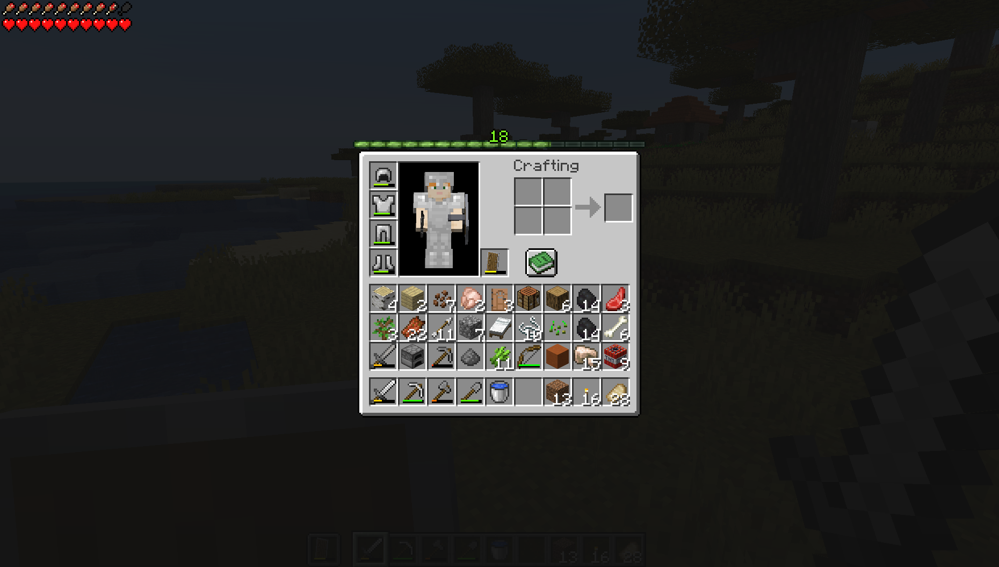
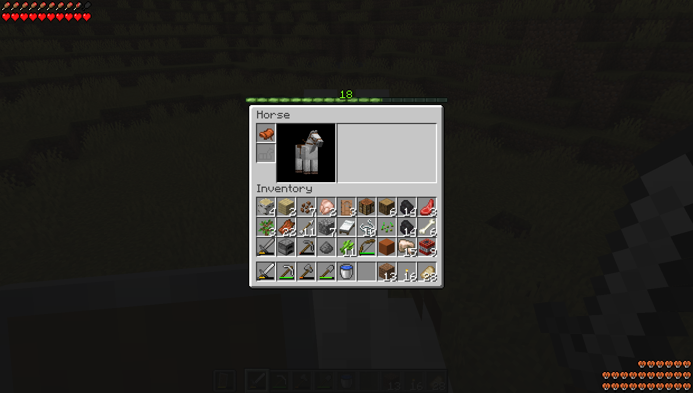

# Fried HUD

This mod shuffles around and hides HUD elements to my own personal liking.

The goal of this mod is to have the HUD almost wholly hidden the vast majority of the time, the usual state being only showing the player's arms (and held items). Useful information such as the player's hotbar and hearts will appear momentarily on the screen as they become relevant.

It should be noted that this mod is not configurable because I have already configured it the way I want it.

## Features

- The armor points display has been removed.
- The hotbar will show momentarily if the player's selected slot is changed.
- The player's food, hearts, and air bubbles have been grouped together and moved to the top left corner of the screen.
  - This grouping always shows together as one unit, and is referred to here collectively as the player's health.
  - The player's food and air bubbles now deplete from right to left in order to match the depletion of their hearts.
  - The player's health will show momentarily if:
    - They are freezing at all.
    - They are eating or drinking an item.
    - They have the hunger effect.
    - Their food depletes to 5 or more missing haunches if they are undamaged or if it depletes to 1.5 or more missing haunches if they are damaged.
    - They lose hearts.
    - They gain hearts.
    - They are losing air.
    - They are gaining air but their air is not yet full.
- The vehicle health has been moved to the bottom right corner of the screen.
  - The vehicle health will show when the player starts riding the vehicle.
- The player's health and vehicle health will appear in the player's inventory, and will momentarily remain visible after exiting the inventory.
- The hotbar will appear behind the transparent background when in container menus (such as in chests and the player's inventory) and will momentarily remain visible after exiting the menu.
- The player's health, vehicle health, and hotbar will show momentarily upon entering a new world or dimension.
- The experience bar has been moved to being exclusively above the player's inventory.
  - The transparent background of containers has been slightly darkened, mainly in order to make the experience bar more visible.
- The vehicle jump bar will only appear if it's charged at all or under cooldown, and then will fade away.
- The crosshair will only appear if an entity or block is within reach of the player, or if they are aiming a bow, a crossbow, or a trident.
  - The debug crosshair will still appear when in the debug menu.

## Showcase

Player inventory:

Horse inventory:

